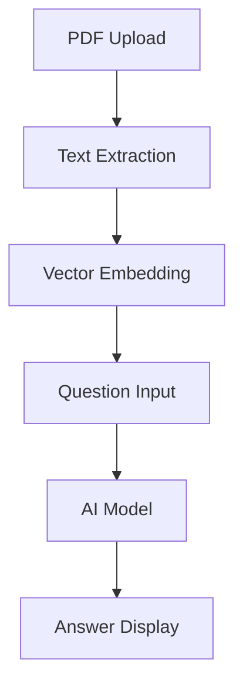

<div align="center">
  
</div>

<p align="center">
  
</p>

<hr>

<div align="center">
  
[](https://streamlit.io/)
[](https://huggingface.co/)
[](./LICENSE)
[](https://github.com/Sakshi983-cmd/-pdf-qa-bot/stargazers)

</div>

<p align="center">
🤖 <b>PDF Question Answering Bot</b><br>
Author: <b>Sakshi Tiwari</b>
</p>

---

## 🦾 Introduction

**PDF Question Answering Bot** ek intelligent tool hai jo aapko PDF upload karne aur un par sawal poochne ki suvidha deta hai. Yeh AI models se powered hai, jo aapke sawalon ke sahi aur relevant jawab deta hai.

> Apne documents ka gyaan paaiye, instant aur smart tareeke se!

---

## 📊 System Workflow



---


```

---

## ✨ Features

- ⚡ **Drag & Drop PDF Upload**
- 🧠 **AI-powered Question Answering**
- 🔎 **Contextual Answers with Confidence Score**
- 🚦 **Streamlit Interface**
- 🏗️ **Modular Architecture**
- 📊 **Transparent outputs for trust and verification**

---

## 🚀 Quick Start

### 1. Environment Setup

```bash
git clone https://github.com/Sakshi983-cmd/-pdf-qa-bot.git
cd -pdf-qa-bot
pip install -r requirements.txt
```

### 2. Run the App

```bash
streamlit run app.py
```
- PDF upload karo
- Sawal poochho
- Jawab instantly pao

---

## 🛠 Technologies Used

- Python
- Streamlit
- HuggingFace Transformers / LangChain
- FAISS / Pinecone (Vector DB)
- OpenAI / Local LLMs

---

## 📚 Inspired By

Project inspired by [Alibaba DeepResearch](https://github.com/Alibaba-NLP/DeepResearch).

---

## 📬 Contact

For queries or collaboration:  
**Author:** Sakshi Tiwari  
GitHub: [Sakshi983-cmd](https://github.com/Sakshi983-cmd)  
Email: [your-email@example.com] <!-- Apna email dal sakte ho -->

---

## 🏷 Citation

```bibtex
@misc{pdfqabot2025,
  author = {Sakshi Tiwari},
  title = {PDF Question Answering Bot},
  year = {2025},
  howpublished = {\url{https://github.com/Sakshi983-cmd/-pdf-qa-bot}}
}
```

---

## 📝 License

MIT License. Details in [LICENSE](LICENSE).

