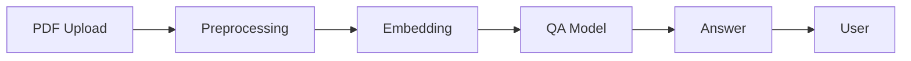

<div align="center">
  
</div>

<hr>

<div align="center" style="line-height: 1;">
  
[](https://streamlit.io/)
[](https://huggingface.co/)
[](./LICENSE)
[](https://github.com/Sakshi983-cmd/-pdf-qa-bot)
</div>

<p align="center">
🤖 <b>PDF Question Answering Bot</b><br>
Author: <b>Sakshi Tiwari</b>
</p>

---

## 🦾 Introduction

**PDF Question Answering Bot** is an intelligent assistant that lets users upload PDF files, ask natural language questions, and receive instant, accurate answers powered by advanced AI models.

> Unlock the knowledge inside your documents with one click—fast, scalable, and designed for deep information-seeking.

---

## 🎬 Demo

<p align="center">
  
</p>

---

## 📊 System Workflow

<p align="center">
  
</p>

Or view as code:


- **PDF Upload:** User provides the document.
- **Preprocessing:** Text extraction and cleaning.
- **Embedding:** Converts text to machine-understandable vectors.
- **QA Model:** AI model processes queries using document context.
- **Answer:** Response is delivered to the user.

---

## ✨ Features

- ⚡ **Drag & Drop PDF Upload:** Simple, fast document handling.
- 🧠 **AI-powered Question Answering:** Ask any question about your PDFs.
- 🔎 **Contextual Answers:** Returns relevant content snippets with confidence scores.
- 🚦 **Streamlit Interface:** Intuitive and responsive UI.
- 🏗️ **Modular Architecture:** Easily extendable with new models or features.
- 📊 **Confidence & Context Preview:** Transparent outputs for trust and verification.

---

## 🚀 Quick Start

### 1. Environment Setup
- Python >=3.8
- [pip](https://pip.pypa.io/en/stable/)
- (Optional) Docker

```bash
git clone https://github.com/Sakshi983-cmd/-pdf-qa-bot.git
cd -pdf-qa-bot
pip install -r requirements.txt
```

### 2. Run the App

```bash
streamlit run app.py
```

- Upload your PDF file.
- Ask a question in natural language.
- Get instant answers with context and confidence score.

---

## 🛠 Technologies Used

- **Python**
- **Streamlit**
- **HuggingFace Transformers / LangChain**
- **FAISS / Pinecone (Vector DB)**
- **OpenAI / Local LLMs**

---

## 🌟 Star History

<div align="center">
  <a href="https://star-history.com/#Sakshi983-cmd/-pdf-qa-bot&Date">
    
  </a>
</div>

---

## 📚 Inspired By

README and project inspired by [Alibaba DeepResearch](https://github.com/Alibaba-NLP/DeepResearch).

---

## 📬 Contact

For questions, suggestions, or collaboration:  
**Author:** Sakshi Tiwari  
GitHub: [Sakshi983-cmd](https://github.com/Sakshi983-cmd)  
Email: [your-email@example.com] <!-- Update with your preferred email address -->

---

## 🏷 Citation

If you use this project, please cite as:

```bibtex
@misc{pdfqabot2025,
  author = {Sakshi Tiwari},
  title = {PDF Question Answering Bot},
  year = {2025},
  howpublished = {\url{https://github.com/Sakshi983-cmd/-pdf-qa-bot}}
}
```

---

## 📝 License

This project is licensed under the MIT License. See the [LICENSE](LICENSE) file for details.
